# State Machine — improving-test-suites

Finite-state execution model for this skill. **This file is the sole normative source for states, transitions, guards, loops, and terminals.** The Mermaid diagram at the end is illustrative only and must not introduce behavior. Subagent status detail: [`references/orchestration-protocol.md`](./references/orchestration-protocol.md).

## States

| State | Kind | Role |
| --- | --- | --- |
| `Intake` | active | Normalize inputs; choose resume vs fresh |
| `Resume` | active | Restore packet; jump to its named next step |
| `ResolveTargets` | active | Expand `TARGET_TEST_FILES` to existing files |
| `AskTarget` | active | Ask for targets |
| `ValueReview` | active | Dispatch `test-value-reviewer` |
| `AskValue` | active | Ask value blocker/clarification |
| `ReviewFanout` | active | Read routes from value report; dispatch routed `ApiReview` and `MaintReview` concurrently |
| `ApiReview` | active | Dispatch `api-security-reviewer` (concurrent branch) |
| `MaintReview` | active | Dispatch `test-maintainability-reviewer` (concurrent branch) |
| `ReviewJoin` | active | Wait for all routed reports; apply sufficiency checklist; record remaining risk |
| `AskReview` | active | Ask one focused API/security or maintainability question |
| `Synthesis` | active | Build `MINIMAL_HARNESS_DECISION` |
| `DualAuthority` | active | Production / non-additive shared-helper approval |
| `WorkspaceRisk` | active | Dirty-target / no-VCS gates; capture pre-mutation diff baseline |
| `AskDirty` | active | Offer commit / stash / abort for dirty targets |
| `AskNoVcs` | active | Ask no-VCS acknowledgment |
| `PlanApproval` | active | Plan gate or recorded `AUTO_APPROVE` |
| `AskPlan` | active | Ask itemized plan approval |
| `Refactor` | active | Dispatch `test-refactorer` |
| `AskRefactor` | active | Ask refactor scope question |
| `Conformance` | active | Map decisions ↔ actions ↔ surviving tests; inspect VCS diff |
| `AskConform` | active | Ask conformance user decision |
| `Validate` | active | Dispatch `test-validator` |
| `AskValidate` | active | Ask validation command/permission |
| `Repair` | active | Cause-first repair; increment `REPAIR_TOTAL` |
| `TerminalChanged` | terminal | `CHANGED_PASS` |
| `TerminalNoChange` | terminal | `COMPLETE_NO_SAFE_CHANGE` |
| `TerminalBug` | terminal | `COMPLETE_PRODUCTION_BUG_EXPOSED` |
| `TerminalFailed` | terminal | `VALIDATION_FAILED_AFTER_REPAIR` |
| `TerminalError` | terminal | `COMPLETE_ERROR` |
| `TerminalBlocked` | terminal | `COMPLETE_BLOCKED` (+ resume packet) |

## Transitions

Guards are evaluated top-to-bottom per source state; the first matching row wins.

| From | To | Guard / event |
| --- | --- | --- |
| `[*]` | `Intake` | run start |
| `Intake` | `Resume` | `RESUME_PACKET` present |
| `Intake` | `ResolveTargets` | fresh run |
| `Resume` | resume target | `next step` in packet (see Resume Targets) |
| `ResolveTargets` | `ValueReview` | ≥1 existing test file |
| `ResolveTargets` | `AskTarget` | zero files |
| `AskTarget` | `ResolveTargets` | answered |
| `AskTarget` | `TerminalBlocked` | no answer |
| `ValueReview` | `ReviewFanout` | `VALUE_STATUS=PASS` |
| `ValueReview` | `AskValue` | `BLOCKED` or `NEEDS_CLARIFICATION` |
| `ValueReview` | `ValueReview` | first `ERROR` this dispatch and `REPAIR_TOTAL < 3` (increment; one retry) |
| `ValueReview` | `TerminalError` | `ERROR` otherwise |
| `AskValue` | `ValueReview` | answered |
| `AskValue` | `TerminalBlocked` | no answer |
| `ReviewFanout` | `ApiReview` ∥ `MaintReview` | each review routed `required` or `optional` is dispatched concurrently |
| `ReviewFanout` | `ReviewJoin` | no review routed |
| `ApiReview` | `ReviewJoin` | report returned (any status) |
| `MaintReview` | `ReviewJoin` | report returned (any status) |
| `ReviewJoin` | `Synthesis` | every routed review resolved: `PASS` / `NOT_APPLICABLE`, or non-pass optional review whose sufficiency checklist passes (remaining risk recorded) |
| `ReviewJoin` | `AskReview` | non-pass required review with a recoverable question, or non-pass optional review whose checklist fails |
| `ReviewJoin` | `TerminalError` | required review `ERROR` with no recoverable question after first-error retry |
| `AskReview` | `ReviewFanout` | answered (redispatch only the affected reviews) |
| `AskReview` | `TerminalBlocked` | no answer |
| `AskReview` | `TerminalError` | unrecoverable `ERROR` |
| `Synthesis` | `Validate` | **no safe edit justified** (zero eligible harness actions) |
| `Synthesis` | `DualAuthority` | safe edit + production/non-additive shared helper |
| `Synthesis` | `WorkspaceRisk` | safe edit + test-tree only |
| `DualAuthority` | `WorkspaceRisk` | approved and `SCOPE_LIMITS` permits |
| `DualAuthority` | `TerminalBug` | declined bug driver |
| `DualAuthority` | `Synthesis` | declined otherwise (replan) |
| `DualAuthority` | `TerminalBlocked` | no answer |
| `WorkspaceRisk` | `PlanApproval` | clean VCS, or dirty resolved, or no-VCS acknowledged; diff baseline captured |
| `WorkspaceRisk` | `AskDirty` | dirty targets unresolved |
| `WorkspaceRisk` | `AskNoVcs` | no VCS without acknowledgment |
| `AskDirty` | `WorkspaceRisk` | user committed, stashed, or explicitly approved proceeding dirty |
| `AskDirty` | `TerminalBlocked` | abort, declined, or no answer |
| `AskNoVcs` | `WorkspaceRisk` | acknowledged |
| `AskNoVcs` | `TerminalBlocked` | declined or no answer |
| `PlanApproval` | `Refactor` | `AUTO_APPROVE=true` recorded, or plan already approved/amended |
| `PlanApproval` | `AskPlan` | `AUTO_APPROVE=false` |
| `AskPlan` | `Refactor` | approved or amended |
| `AskPlan` | `TerminalNoChange` | declined |
| `AskPlan` | `TerminalBlocked` | no answer |
| `Refactor` | `Conformance` | `PASS` |
| `Refactor` | `AskRefactor` | `BLOCKED` or `NEEDS_CLARIFICATION` |
| `Refactor` | `TerminalBug` | `FAIL` production bug outside scope |
| `Refactor` | `TerminalBlocked` | `FAIL` otherwise |
| `Refactor` | `Repair` | `ERROR` and active repair and budget left |
| `Refactor` | `Refactor` | first `ERROR` this dispatch outside repair and `REPAIR_TOTAL < 3` (increment; one retry) |
| `Refactor` | `TerminalError` | `ERROR` otherwise |
| `AskRefactor` | `Refactor` | answered |
| `AskRefactor` | `TerminalBlocked` | no answer |
| `Conformance` | `Validate` | conformance passes (including diff inspection) |
| `Conformance` | `Repair` | repairable mismatch and budget left |
| `Conformance` | `AskConform` | needs user decision |
| `AskConform` | `Synthesis` | answered |
| `AskConform` | `TerminalBlocked` | no answer |
| `Validate` | `TerminalChanged` | `PASS` with changed files |
| `Validate` | `TerminalNoChange` | `PASS` with no changes |
| `Validate` | `AskValidate` | `BLOCKED` |
| `Validate` | `Validate` | first `ERROR` this dispatch outside repair and `REPAIR_TOTAL < 3` (increment; one retry) |
| `Validate` | `TerminalError` | `ERROR` otherwise |
| `Validate` | `TerminalBug` | `FAIL` no changes + production bug |
| `Validate` | `TerminalNoChange` | `FAIL` no changes otherwise |
| `Validate` | `Repair` | `FAIL` with changed files |
| `AskValidate` | `Validate` | answered |
| `AskValidate` | `TerminalBlocked` | no answer |
| `Repair` | `Refactor` | test-edit repair; `REPAIR_TOTAL < 3` |
| `Repair` | `Validate` | validation retry; `REPAIR_TOTAL < 3` |
| `Repair` | `DualAuthority` | production fix in scope |
| `Repair` | `TerminalFailed` | budget exhausted / pre-existing / unknown no retry |
| `Repair` | `TerminalBug` | production bug declined or out of scope |
| each `Terminal*` | `[*]` | handoff emitted |

## Concurrency

`ReviewFanout` dispatches every routed review at the same time when the runtime supports concurrent subagents; a runtime without them runs the same dispatches serially inline. Join semantics are identical either way: `ReviewJoin` acts only after every dispatched review has a report, and the outcome must not depend on completion order. A dispatch that crashes or returns nothing is treated as `ERROR` for that review. First-error retries of a review redispatch only that review.

## Resume Targets

`Resume` may jump only to: `ResolveTargets`, `ValueReview`, `ReviewFanout`, `Synthesis`, `DualAuthority`, `WorkspaceRisk`, `PlanApproval`, `Refactor`, `Conformance`, `Validate`, `Repair`. This list is stated only here. A packet naming any other state is invalid; re-enter at the nearest earlier target.

## Repair Loop

| Attribute | Value |
| --- | --- |
| Counter | `REPAIR_TOTAL` |
| Owner | Orchestrator |
| Initial value | `0` at `Intake` (restored from packet on resume) |
| Increment point | Immediately before each repair attempt or first-error retry |
| Cap | `3` |
| Over-cap route | `TerminalFailed` (`TerminalBug` if a production bug was identified; `TerminalError` for an `ERROR` with no remaining retry) |

## Guards (load-bearing)

| Guard | Definition |
| --- | --- |
| Safe edit justified | `MINIMAL_HARNESS_DECISION` contains ≥1 keep/rewrite/delete/consolidate/add item eligible for file mutation |
| Dirty targets | Version control reports uncommitted changes in files the run may edit (checked via `git status --porcelain` on resolved targets) |
| No VCS | No version-control metadata for the workspace |
| Optional sufficiency | (1) `VALUE_STATUS=PASS`; (2) every high-value behavior has a coverage rating; (3) value routing reason does not mention the blocked surface |
| First-error retry | Any subagent dispatch returning `ERROR` outside an active repair gets exactly one same-dispatch retry, incrementing `REPAIR_TOTAL`; a second `ERROR` follows that state's `ERROR otherwise` route |
| `AUTO_APPROVE` bypass | Input `true` recorded in handoff; bypasses **plan gate only**. In a headless run (no answer channel), unresolved dirty targets therefore always end `COMPLETE_BLOCKED` |
| Diff baseline | `WorkspaceRisk` records workspace state before mutation so `Conformance` can compare reported actions against the actual VCS diff |

## Terminals

| State              | Handoff status                    |
| ------------------ | --------------------------------- |
| `TerminalChanged`  | `CHANGED_PASS`                    |
| `TerminalNoChange` | `COMPLETE_NO_SAFE_CHANGE`         |
| `TerminalBug`      | `COMPLETE_PRODUCTION_BUG_EXPOSED` |
| `TerminalFailed`   | `VALIDATION_FAILED_AFTER_REPAIR`  |
| `TerminalError`    | `COMPLETE_ERROR`                  |
| `TerminalBlocked`  | `COMPLETE_BLOCKED`                |

## Illustrative Diagram (non-normative)

This diagram visualizes the table above. If they ever disagree, the table wins.

```mermaid
stateDiagram-v2
  [*] --> Intake
  Intake --> Resume: RESUME_PACKET present
  Intake --> ResolveTargets: fresh run
  Resume --> ResolveTargets: named resume target

  ResolveTargets --> ValueReview: files resolved
  ResolveTargets --> AskTarget: zero files
  AskTarget --> ResolveTargets: answered
  AskTarget --> TerminalBlocked: no answer

  ValueReview --> ReviewFanout: PASS
  ValueReview --> AskValue: BLOCKED or NEEDS_CLARIFICATION
  ValueReview --> TerminalError: ERROR after retry
  AskValue --> ValueReview: answered
  AskValue --> TerminalBlocked: no answer

  state ReviewFanout {
    [*] --> ApiReview
    [*] --> MaintReview
  }
  ReviewFanout --> ReviewJoin: all routed reports in (or none routed)
  ReviewJoin --> Synthesis: resolved (risk recorded for optional non-pass)
  ReviewJoin --> AskReview: recoverable question or checklist fail
  ReviewJoin --> TerminalError: required unrecoverable ERROR
  AskReview --> ReviewFanout: answered
  AskReview --> TerminalBlocked: no answer
  AskReview --> TerminalError: unrecoverable ERROR

  Synthesis --> Validate: no safe edit justified
  Synthesis --> DualAuthority: production or shared-helper edit
  Synthesis --> WorkspaceRisk: test-tree edit only
  DualAuthority --> WorkspaceRisk: approved
  DualAuthority --> TerminalBug: declined bug driver
  DualAuthority --> Synthesis: declined (replan)
  DualAuthority --> TerminalBlocked: no answer
  WorkspaceRisk --> PlanApproval: clean or resolved; baseline captured
  WorkspaceRisk --> AskDirty: dirty targets
  WorkspaceRisk --> AskNoVcs: no VCS
  AskDirty --> WorkspaceRisk: commit or stash or approved
  AskDirty --> TerminalBlocked: abort or no answer
  AskNoVcs --> WorkspaceRisk: acknowledged
  AskNoVcs --> TerminalBlocked: declined or no answer
  PlanApproval --> Refactor: approved or AUTO_APPROVE recorded
  PlanApproval --> AskPlan: needs approval
  AskPlan --> Refactor: approved or amended
  AskPlan --> TerminalNoChange: declined
  AskPlan --> TerminalBlocked: no answer

  Refactor --> Conformance: PASS
  Refactor --> AskRefactor: BLOCKED or NEEDS_CLARIFICATION
  Refactor --> TerminalBug: FAIL bug outside scope
  Refactor --> TerminalBlocked: FAIL otherwise
  Refactor --> Repair: ERROR in active repair
  Refactor --> TerminalError: ERROR after retry
  AskRefactor --> Refactor: answered
  AskRefactor --> TerminalBlocked: no answer

  Conformance --> Validate: passes incl. diff inspection
  Conformance --> Repair: repairable mismatch
  Conformance --> AskConform: user decision
  AskConform --> Synthesis: answered
  AskConform --> TerminalBlocked: no answer

  Validate --> TerminalChanged: PASS with changes
  Validate --> TerminalNoChange: PASS or FAIL with no changes
  Validate --> AskValidate: BLOCKED
  Validate --> TerminalError: ERROR after retry
  Validate --> TerminalBug: FAIL no changes and bug
  Validate --> Repair: FAIL with changes
  AskValidate --> Validate: answered
  AskValidate --> TerminalBlocked: no answer

  Repair --> Refactor: test edit, budget left
  Repair --> Validate: validation retry, budget left
  Repair --> DualAuthority: production fix in scope
  Repair --> TerminalFailed: budget exhausted or pre-existing
  Repair --> TerminalBug: bug declined or out of scope

  TerminalChanged --> [*]
  TerminalNoChange --> [*]
  TerminalBug --> [*]
  TerminalFailed --> [*]
  TerminalError --> [*]
  TerminalBlocked --> [*]
```

